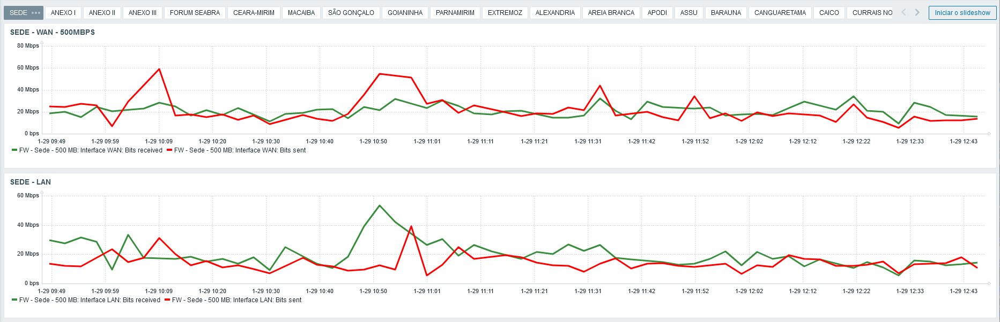

# Monitoramento de Internet no Zabbix

Este repositório no GitHub contém uma solução para criar um Dashboard de Monitoramento de Internet utilizando o Zabbix. Este README fornecerá uma visão geral do projeto, instruções sobre como configurar e usar a solução e informações sobre como contribuir.

## Visão Geral

O **Dashboard de Monitoramento de Internet no Zabbix** é uma ferramenta desenvolvida para monitorar a conectividade com a Internet em uma rede. Ele utiliza o Zabbix, uma plataforma de monitoramento empresarial, para coletar e exibir informações sobre a disponibilidade e desempenho da conexão com a Internet. Este dashboard é útil para administradores de rede e equipes de operações que desejam garantir uma conectividade estável e confiável para seus sistemas e usuários.

## Funcionalidades

- Monitoramento contínuo da disponibilidade da conexão com a Internet.
- Registro de métricas de latência, jitter e perda de pacotes.
- Interface de usuário intuitiva para visualização rápida e análise dos dados coletados.
- Alertas configuráveis para notificar sobre problemas de conectividade.

## Uso

- Acesse o painel do Zabbix e navegue até o dashboard criado utilizando o template importado.
- Analise as métricas de disponibilidade, latência, jitter e perda de pacotes.
- Utilize os filtros e opções de visualização para obter insights sobre o desempenho da conexão com a Internet.
- Responda prontamente aos alertas gerados pelo sistema para resolver problemas de conectividade.

- 

