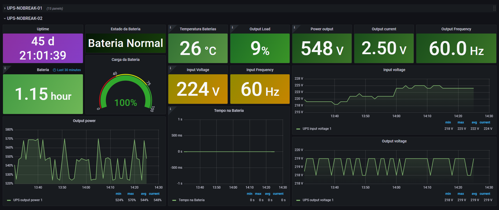
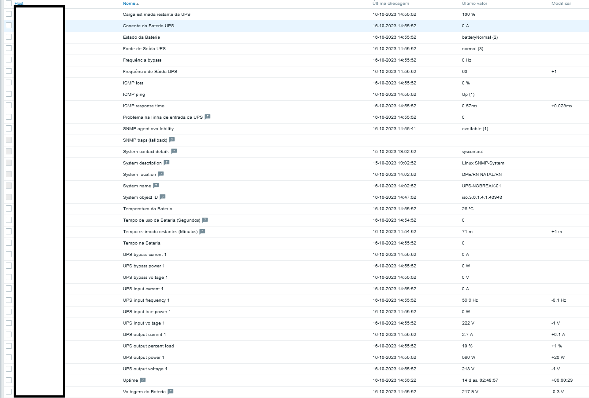

# Dashboar de monitoramento dos Nobreaks via SNMP. 

# ****Introdução****

Neste projeto, implementamos um sistema de monitoramento de nobreaks para garantir a disponibilidade contínua de energia em um ambiente crítico. Utilizamos o Grafana para criar um dashboard informativo e intuitivo que permite o acompanhamento em tempo real do status dos nobreaks.

# Pré-requisitos

- Data Source (Zabbix, Prometheus… etc.)
- Grafana instalado.

# Screenshots

Dashboard criada no grafana para monitoramento dos nobreaks. 

### Tabela com dados do template do zabbix

| Input | Output | Bateria | System | Bypass |
| --- | --- | --- | --- | --- |
| UPS input voltage 1 | UPS output voltage 1 | Tempo na Bateria | System contact details | Frequência bypass |
| UPS input true power 1 | UPS output power 1 | Tempo estimado restantes (Minutos) | System contact details | UPS bypass current 1 |
| UPS input frequency 1 | UPS output percent load 1 | Tempo de uso da Bateria (Segundos) | System contact details | UPS bypass power 1 |
| UPS input current 1 | UPS output current 1 | Temperatura da Bateria | System contact details | UPS bypass voltage 1 |
| Problema na linha de entrada da UPS | Fonte de Saída UPS | Carga estimada restante da UPS | System contact details |  |
|  | Frequência de Sáida UPS | Corrente da Bateria UPS | Uptime |  |
|  |  | Estado da Bateria |  |  |
|  |  | Voltagem da Bateria |  |  |

# Referência do repositório

[zbx_export_templates_ups_rfc_1628_snmp.yaml](img/zbx_export_templates_ups_rfc_1628_snmp%201.yaml)

[zbx_export_templates_ups_diogont.yaml](img/nobreak-ups-dashboard/img/zbx_export_templates_ups_triph_diogont.yaml)

/template_network_ups_(generic)/5.4)

/UPS_Templates/template_module_ups/5.4/template_module_ups.yaml)

# Funcionalidades

O dashboard de monitoramento oferece as seguintes funcionalidades:

1. **Monitoramento de dois nobreaks da marca voltronic power:** a dashboard é projetada para monitorar dois nobreaks da marca
Voltronic Power. Os dados desses nobreaks são exibidos em tempo real no
painel.
2. **Status e Informações Detalhadas**: você pode acompanhar o status atual de cada nobreak, incluindo
informações como a tensão da bateria, carga, tempo de funcionamento
restante e eventos recentes.
3. **Alertas e Notificações**: Configure alertas personalizados para serem acionados com base em
condições específicas dos nobreaks, como falhas na bateria ou
sobrecarga. Isso permite que a equipe de manutenção reaja rapidamente a
problemas.
4. **Histórico de Dados:** a dashboard armazena históricos de dados dos nobreaks, permitindo a
análise de tendências e o planejamento de manutenção preventiva.

# Template do Zabbix

Abaixo segue as informações coletadas pelo zabbix. 

